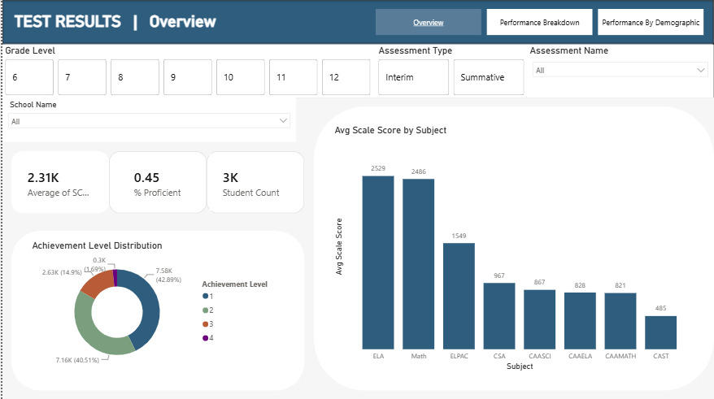
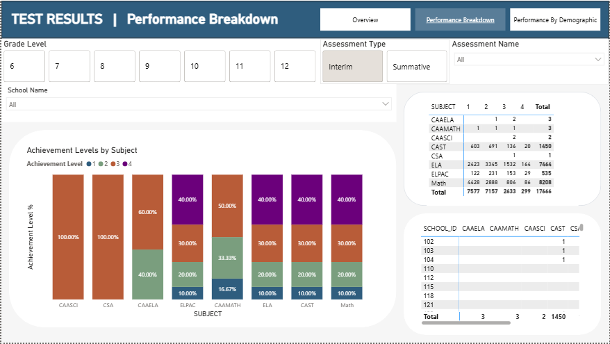

# State Testing Analytics Dashboard
A dimensional analytics pipeline built with dbt, Snowflake Computing, and Power BI that transforms California State Testing Data for a school district into a Power BI dashboard for analyzing test performance across subject, school location, and demographic measures.

---

## Overview
This project consumes and models State Testing data for a school district, delivered by CAASPP in the form of a flat `.csv` file. This data contains the complete set of state tests taken across a school year across the district, containing demographic, academic, and school enrollment information. The dashboard enables school district and site administration to measure achievement levels across differing subjects, school sites, grade levels, and demographic segments. This information can be used to identify performance gaps and inequities across the measure student body.

---

## Dashboard



**What does the dashboard show?**

The key performance indicators demonstrated from the overview page include the percentage of the students achieving a Proficient classification on Achivement (as identified by a 3 or 4 on the Scaled Score Achievement Level), as well as how many students tested and the average scaled score. Users may filter by grade level, type of test, subject of test, and which school site hosted the testing. This enables users to focus in on specific subject areas, interim versus summative tests, and particular school sites.



---

## Architecture

```text
[Source / Seed Data]
        |
        v
[dbt Staging View]
        |
        v
[Snowflake Dimensional Models]
        |
        v
[Power BI Semantic Model]
        |
        v
[Power BI Dashboard]
```

The raw data is delivered from CAASPP in flat file form and manually ingested, as permissions for download of district data are limited to administrative users of school sites, and no API access is granted. In staging, data types and column names are declared. Dimensional models then normalize entities such as assessment, student, and school site. dbt tests for uniqueness and absence of nulls occur at and between the staging and dimension tables, while relationship integrity is checked at the fact table in relationship to the dimensions.

### dbt Lineage

The dbt DAG below shows the transformation path from the anonymized
source data through staging and into the dimensional models consumed
by Power BI.


The staging layer standardizes source data before it is modeled into
student, school, and assessment dimensions and the testing-event fact table.

---

## Data Model

The warehouse uses a star schema centered on testing events.

### Fact Table

#### `fact_test_events`

**Grain:**  

One row represents one test taken by one student.

Important fields:

| Column | Description |
| --- | --- |
| `school_id` | Location where the student tested, taken to be the student's school of enrollment at the time. |
| `student_identifier` | Unique ID number assigned to student at enrollment. |
| `assessment_name` | Specific assessment of a given academic subject and grade level |
| `school_year` | Academic year wherein the assessment was administered |
| `grade_level_when_assessed` | Stage in student's academic career at time of testing event |
| `submit_time` | Time at which the student submitted the completed assessment for grading. |
| `scale_score` | Score assigned as grade for student's work on test |
| `scale_score_achievement_level` | Student's noted achievement band relative to score. |

### Dimensions

#### `dim_students`

**Grain:** One row per student.

#### `dim_schools`

**Grain:** One row per school site.

#### `dim_assessments`

**Grain:** One row per assessment used in a testing event.


---

## Data Transformation

The dbt staging layer establishes a clean, typed contract between the source data and downstream analytical models.

### Cleaning and Standardization
Upon ingestion, most numbers representing scores required explicit type casting, and were also likely to contain non-NULL null values as well. In addition, many text columns required transformation into boolean, as their values consisted of either 'yes' or some variation of 'missing' or 'na'. Identifiers were kept as strings, as their contained alphanumeric information. While date and time fields were not normalized in this project, as time series analysis was beyond the scope of the project, work on the SUBMITTEDDATETIME columns would be required to track student performance over the school year. At present, the vast majority of summative state tests are administered in the first weeks of May of the given school year, and such information was note required by stakeholders for the immediate use case.

---

## Data Quality

Tests used:

- `unique`
- `not_null`
- `accepted_values`
- `relationships`

### Example Modeling Lesson

A uniqueness test on `dim_students` exposed duplicate student records because a time-varying attribute, typically either migrant status or English Lanugage Acquisition status, had been placed in a one-row-per-student dimension. Moving that attribute to the testing-event fact table restored the intended grain.

---
## Data Governance

For use in this portfolio, actual state testing data was anonymized via school name replacement and one-way hashing of the student identifier values. This took place in a separate workflow on developer's hard drive. Only anonymized data was committed to the repository or uploaded to the project's compute environment.

---
## Power BI Model

Power BI connects to the Snowflake dimensional models and provides the reporting and visualization layer. 
The following tables were imported into Power BI:
- DIM_STUDENTS
- DIM_SCHOOLS
- DIM_ASSESSMENTS
- FACT_TABLE_EVENTS
These are related via Primary Key relationships in the dimensions to foreign keys present in the fact table.

DAX measures for Proficiency Count and Student Count were developed, order to establish a measure of what percentage of students achieved a Proficient Status (defined by a 3 or a 4 for Scale Score Achievement Level) on given tests. Most transformation logic was kept upstream in Snowflake, in order to maintain quick loading speeds for the dashboard.  


---

## Technology Stack

| Technology | Role |
| --- | --- |
| Snowflake | Data warehouse and model storage |
| dbt | Transformation, modeling, testing, and documentation |
| SQL | Data transformation and dimensional modeling |
| Power BI | Semantic modeling and dashboard development |
| Power Query | Final BI-layer cleanup and shaping |
| Git / GitHub | Version control and project repository |

Edit the descriptions above to match exactly what you used.

---

## Repository Structure

```text
.
├── models/
│   ├── staging/
│   │   └── ...
│   └── marts/
│       ├── dims/
│       │   └── ...
│       └── facts/
│           └── ...
├── seeds/
│   └── ...
├── tests/
│   └── ...
├── dbt_project.yml
└── README.md
```

---

## Key Design Decisions

### 1. Dimensional Modeling

**Decision:**  
Star schema

**Why:**  
The measured dimension focuses on a number of transactions, in this case between the student and the assessment offering. As such we have a number of mostly static dimensions interacting through an historical stream. This makes a fact table associating the many-to-many cardinality of such a setup the natural point of analysis.

### 2. Testing Event Grain

**Decision:**  
Testing event associates one student taking one test at one time, per row.

**Why:**  
The event grain captures the mutable qualities of the relationship between dimensions, while the comparatively immutable attributes of students, tests, etc, are captured in the dimension tables.

### 3. Assessment Natural Key

**Decision:**  
AssessmentName was used as a natural key.

**Why:**  
The specific instances of published assessments are proprietary artifacts of CAASPP, meaning their identity as a particular test is highly stable.

### 4. Transformation in dbt

**Decision:**  
Data typing and column names were established at the staging level.

**Why:**  
Fewer transformations at the presentation layer provides both QA assurance within the database, and minimizes computational demands on Power BI.

---

## Running the Project

### Prerequisites

- Snowflake account
- dbt
- Power BI Desktop
- Git

### Build the dbt Project

Complete the following steps using the Snowflake dbt UI:
```
dbt deps
dbt seed
dbt build
```

### Power BI
Power BI connects to Snowflake via Microsoft's Get Data functionality.

---

## Future Improvements

Possible ideas:
- Increased historical depth by reconciling dimensions to longer event range
- Add CI checks for dbt builds and tests

